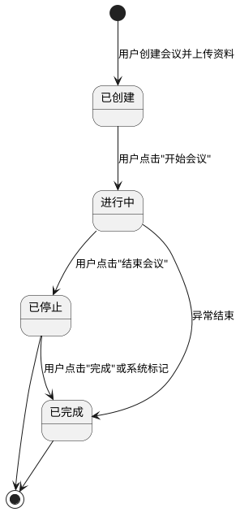
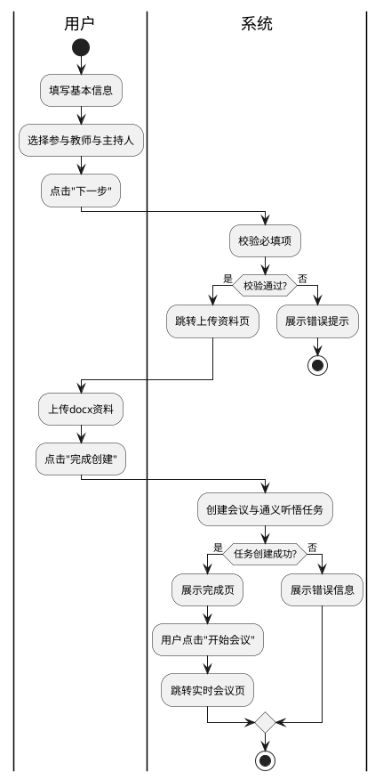
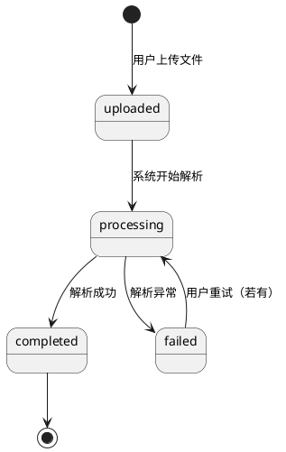

# 流程与状态图表

> 返回 [PRD 总览](./README.md)

---

## 4.1 会议生命周期状态机

```plantuml
@startuml
[*] --> 已创建 : 用户创建会议并上传资料
已创建 --> 进行中 : 用户点击"开始会议"
进行中 --> 已停止 : 用户点击"结束会议"
已停止 --> 已完成 : 用户点击"完成"或系统标记
进行中 --> 已完成 : 异常结束
已完成 --> [*]
已停止 --> [*]
@enduml
```

## 4.2 会议创建三步流程

```plantuml
@startuml
|用户|
start
:填写基本信息;
:选择参与教师与主持人;
:点击"下一步";
|系统|
:校验必填项;
if (校验通过?) then (是)
  :跳转上传资料页;
else (否)
  :展示错误提示;
  stop
endif
|用户|
:上传docx资料;
:点击"完成创建";
|系统|
:创建会议与通义听悟任务;
if (任务创建成功?) then (是)
  :展示完成页;
  :用户点击"开始会议";
  :跳转实时会议页;
else (否)
  :展示错误信息;
endif
stop
@enduml
```

## 4.3 文档解析状态机

```plantuml
@startuml
[*] --> uploaded : 用户上传文件
uploaded --> processing : 系统开始解析
processing --> completed : 解析成功
processing --> failed : 解析异常
failed --> processing : 用户重试（若有）
completed --> [*]
@enduml
```
