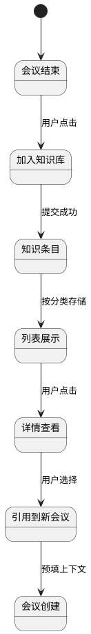

# 备课知识库

> 返回 [PRD 总览](./README.md) | 短期可重点推进

---

## 1. 模块背景

- **需求简介**：建立可检索、可复用的备课知识库，将历次会议中的教案、讨论要点、AI 建议、资源链接沉淀为结构化知识，供后续备课与教研复用。
- **业务诉求**：解决备课成果分散、难以积累与查找的问题；提升教研团队的知识复用效率。

## 2. 业务流程简述

会议结束后自动/手动将摘要、要点、文档摘要写入知识库 → 按学科/年级/单元分类存储 → 用户通过检索或浏览进入知识库 → 按条件筛选、查看、收藏、引用 → 在新建会议时可选「从知识库引用」关联历史案例。

---

## 3. 详细功能需求说明

### 3.1 知识库入口与导航

- **位置**：主导航「备课知识库」；或会议总结页「加入知识库」操作。
- **目标**：提供统一的知识库入口与分类导航。

#### 3.1.1 界面元素与展示规则

- **分类导航**：左侧树形或平铺，一级为学科，二级为年级，三级为单元/主题（可选）；当前选中项高亮。
- **面包屑**：展示当前路径，如「数学 > 初二年级 > 分式」；点击可快速返回上级。
- **空态**：某分类下无内容时，展示「该分类下暂无知识条目」及引导操作。

#### 3.1.2 交互逻辑与状态流转

- **切换分类**：点击分类项，主区域刷新为对应知识列表；支持 URL 参数保持状态。
- **搜索与筛选**：顶部搜索框、学科/年级筛选器；输入时防抖 300ms，失焦或回车触发检索。

#### 3.1.3 异常与系统边界

- **无权限**：仅本人创建的知识或本组共享的知识可查看；无权限时轻提示「无权访问」。

---

### 3.2 知识条目列表

- **位置**：知识库主区域。
- **目标**：展示当前分类下的知识条目，支持排序与快速操作。

#### 3.2.1 界面元素与展示规则

- **列表项字段**：标题、来源会议、学科、年级、创建时间、标签、收藏数（可选）。
- **溢出与截断**：标题单行截断，最大宽度 200px，悬停气泡展示全文。
- **空态**：无结果时展示「暂无相关知识，去创建会议积累吧」及「创建会议」按钮。

#### 3.2.2 交互逻辑与状态流转

- **加载方式**：分页加载，每页 20 条；底部「加载更多」或滚动触底加载。
- **排序**：支持按创建时间、更新时间、相关性排序；切换时重新请求。
- **点击条目**：进入详情页。

#### 3.2.3 异常与系统边界

- **加载失败**：展示「加载失败，点击重试」；断网时相同处理。

---

### 3.3 知识条目详情

- **位置**：点击列表项进入。
- **目标**：完整展示单条知识的摘要、要点、关联文档、来源会议及引用信息。

#### 3.3.1 界面元素与展示规则

- **标题**：来源会议名称或用户自定义标题。
- **摘要**：富文本或纯文本，支持换行。
- **要点列表**：有序或无序列表，每项独立展示。
- **关联文档**：展示会议中上传的文档列表及解析摘要；可展开/折叠。
- **来源会议**：展示会议名称、时间、参与教师；可点击跳转会议总结页。
- **标签**：展示 AI 或用户打的标签；可点击跳转同标签列表。

#### 3.3.2 交互逻辑与状态流转

- **收藏**：点击「收藏」按钮，状态切换为已收藏；再次点击取消收藏。
- **引用**：点击「引用到新会议」，跳转会议创建页并预填学科、年级等；或打开弹窗选择已有会议关联。
- **复制**：支持复制摘要或要点到剪贴板；成功后轻提示「已复制」。

#### 3.3.3 异常与系统边界

- **来源会议已删除**：仍展示知识内容，来源区域显示「原会议已删除」。

---

### 3.4 会议总结写入知识库

- **位置**：会议总结页；或会议列表的「加入知识库」批量操作。
- **目标**：将会议摘要与要点沉淀到知识库。

#### 3.4.1 界面元素与展示规则

- **入口按钮**：「加入知识库」主按钮或次要按钮。
- **弹窗**：标题「加入备课知识库」；表单含标题（可编辑，默认会议名）、分类（学科、年级、单元）、标签（多选或输入）。
- **执行中**：按钮或弹窗内显示加载态；禁用重复提交。

#### 3.4.2 交互逻辑与状态流转

- **触发**：点击「加入知识库」打开弹窗。
- **校验**：标题必填；分类至少选学科。
- **提交成功**：关闭弹窗，轻提示「已加入知识库」；可选「去查看」跳转详情。
- **提交异常**：弹窗内展示错误信息，不关闭。

#### 3.4.3 异常与系统边界

- **重复加入**：同一会议多次加入时，更新原条目或提示「该会议已加入，是否更新？」。

---

### 3.5 新建会议时引用知识库

- **位置**：会议创建流程的「填写基本信息」或「上传资料」步骤。
- **目标**：从知识库选择历史案例作为参考，预填或关联上下文。

#### 3.5.1 界面元素与展示规则

- **入口**：「从知识库引用」链接或按钮。
- **选择弹窗**：展示知识库列表（可搜索、筛选）；支持多选；已选条目高亮展示。

#### 3.5.2 交互逻辑与状态流转

- **选择后**：将引用条目的学科、年级、摘要等带入表单或传给 AI 作为上下文；主区域展示「已引用 N 条知识」。
- **取消引用**：点击移除，清空预填内容（可选二次确认）。

---

## 4. 流程与状态图表

---

## 5. 依赖与边界

- **前置依赖**：会议总结模块（摘要、要点已生成）；文档解析服务（文档摘要）。
- **数据范围**：默认仅本用户创建的知识；可扩展为组内/校内共享（需权限配置）。
