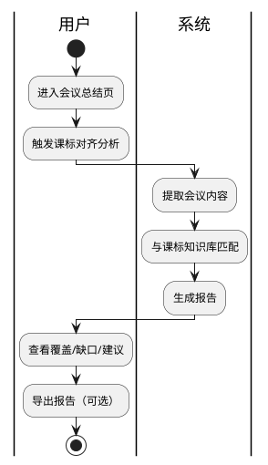

# 课标对齐分析

> 返回 [PRD 总览](./README.md) | 短期可重点推进

---

## 1. 模块背景

- **需求简介**：将备课会议内容与学科课程标准自动对照，标注已覆盖、未覆盖、可拓展的能力点，并给出调整建议。
- **业务诉求**：帮助教师确保备课符合课标要求，减少遗漏与偏差，提升备课质量。

## 2. 业务流程简述

会议结束后（或会议中实时）→ 系统提取备课主题、讨论要点、文档摘要 → 与内置课标知识库比对 → 生成对齐分析报告 → 展示覆盖率、缺口、建议 → 支持导出或关联到会议总结。

---

## 3. 详细功能需求说明

### 3.1 课标对齐分析入口

- **位置**：会议总结页「课标对齐分析」 Tab 或区块；实时会议侧边栏可选「课标建议」。
- **目标**：提供分析入口并展示分析结果。

#### 3.1.1 界面元素与展示规则

- **入口按钮**：「查看课标对齐」或「课标分析」。
- **执行中**：点击后展示「正在分析课标覆盖情况...」及进度条或步骤指示（提取内容→匹配课标→生成报告）。
- **空态**：会议无有效内容（无讨论、无文档）时，展示「暂无足够内容进行分析，请先完成会议讨论或上传备课资料」。

#### 3.1.2 交互逻辑与状态流转

- **触发**：进入会议总结页时自动触发分析（若未分析过）；或用户主动点击「重新分析」。
- **防抖**：同一会议 24 小时内不重复全量分析；用户可强制「重新分析」。

#### 3.1.3 异常与系统边界

- **课标数据缺失**：该学科/年级暂无课标数据时，轻提示「暂不支持该学科的课标分析」。
- **分析超时**：超过 30 秒未完成时，展示「分析超时，请稍后重试」及重试按钮。

---

### 3.2 课标对齐报告展示

- **位置**：课标分析结果主区域。
- **目标**：清晰展示覆盖、缺口、建议三类信息。

#### 3.2.1 界面元素与展示规则

- **总览卡片**：展示整体覆盖率（如「已覆盖 12/15 项，约 80%」）；进度条或环形图；颜色区分（绿/黄/红）。
- **已覆盖**：列表展示已覆盖的课标条目；每条含课标编号、描述、匹配到的讨论/文档片段摘要。
- **未覆盖**：列表展示可能遗漏的课标条目；每条含课标编号、描述、建议补充方向。
- **可拓展**：列表展示可进一步拓展的条目；每条含拓展建议。
- **溢出与截断**：课标描述超长时单行截断，悬停气泡展示全文。

#### 3.2.2 交互逻辑与状态流转

- **展开/折叠**：每个分类（已覆盖/未覆盖/可拓展）可折叠；默认全部展开。
- **定位到讨论**：点击「匹配片段」可跳转到对应会议讨论记录位置（若支持时间轴）。
- **导出**：支持导出为 PDF 或 Word，包含完整报告。

#### 3.2.3 异常与系统边界

- **匹配置信度低**：对低置信度匹配单独标注「仅供参考」；可配置是否展示。

---

### 3.3 课标知识库与配置

- **位置**：后台配置或系统设置（管理员）；普通用户不可见。
- **目标**：维护各学科、年级的课标条目，供分析引擎使用。

#### 3.3.1 数据结构（参考）

- **课标条目**：学科、年级、版本（如 2022 版）、编号、描述、关键词、层级（一级/二级/三级）。
- **版本管理**：支持多版本课标；分析时按会议所属年级、学科选择对应版本。

#### 3.3.2 边界说明

- **课标来源**：需对接官方课标或经教研审核的标准化数据；本模块不定义数据采集方式。

---

## 4. 流程与状态图表

---

## 5. 依赖与边界

- **前置依赖**：会议总结（摘要、要点）；文档解析（文档摘要）；课标知识库（需预先配置）。
- **AI 能力**：可使用大模型辅助「内容→课标」的语义匹配，提高准确率。
