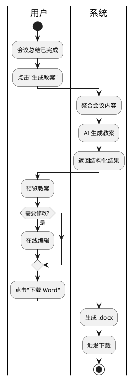

# 教案一键生成

> 返回 [PRD 总览](./README.md) | 短期可重点推进

---

## 1. 模块背景

- **需求简介**：基于会议讨论内容、备课资料摘要与 AI 建议，一键生成规范教案框架（含教学目标、重难点、教学过程等），供教师下载后精细修改。
- **业务诉求**：减少教师从讨论到成稿的重复录入工作，提高备课产出效率。

## 2. 业务流程简述

会议结束并生成总结后 → 用户点击「生成教案」→ 系统聚合会议摘要、要点、文档内容、学科年级信息 → AI 生成结构化教案 → 用户预览、编辑（可选）→ 导出 Word 文档。

---

## 3. 详细功能需求说明

### 3.1 教案生成入口

- **位置**：会议总结页「生成教案」主按钮；或总结页顶部操作栏。
- **目标**：提供教案生成触发入口。

#### 3.1.1 界面元素与展示规则

- **按钮**：「生成教案」或「一键生成教案」；主按钮样式。
- **执行中**：按钮变为「正在生成...」并显示加载动画；禁用重复点击。
- **前置校验**：若会议无摘要或要点，按钮置灰，悬停提示「请先完成会议总结」。

#### 3.1.2 交互逻辑与状态流转

- **触发**：点击按钮发起生成请求。
- **执行成功**：跳转到教案预览页或在本页展开预览区域。
- **执行异常**：轻提示「生成失败，请重试」；按钮恢复可点击态。

#### 3.1.3 异常与系统边界

- **AI 服务不可用**：轻提示「服务暂时不可用，请稍后重试」。
- **内容过长**：若讨论内容超限，自动截取最近 N 条或摘要前 N 字，并在教案中注明「基于会议摘要生成」。

---

### 3.2 教案预览与编辑

- **位置**：生成完成后的预览页或弹窗。
- **目标**：展示生成的教案内容，支持在线微调后导出。

#### 3.2.1 界面元素与展示规则

- **教案结构**：按标准教案格式展示，含课题、学科、年级、课时、教学目标、教学重难点、教学过程（导入—新授—练习—小结）、板书设计、作业布置、教学反思（可选）。
- **静态与动态**：标题、学科、年级等从会议自动带入；教学目标、重难点、教学过程由 AI 生成；用户可编辑的区块有明显标识。
- **空态**：某节无内容时显示占位「（待补充）」或灰色斜体。

#### 3.2.2 交互逻辑与状态流转

- **编辑模式**：点击区块进入编辑态；支持富文本（加粗、列表等）或纯文本；失焦或点击其他区域保存。
- **重新生成**：提供「重新生成」按钮，可针对某节（如教学过程）单独重新生成；执行中该节显示加载态。
- **撤销**：支持简单撤销（如最近一次编辑）；可选「恢复为生成结果」。

#### 3.2.3 异常与系统边界

- **编辑冲突**：多人同时编辑（若有协作）时，以最后保存为准；可扩展为冲突提示。
- **内容校验**：导出前校验必填节（如教学目标）不为空；为空时轻提示「请补充教学目标」。

---

### 3.3 教案导出

- **位置**：教案预览页底部或顶部操作栏。
- **目标**：将教案导出为 Word 文档供本地使用。

#### 3.3.1 界面元素与展示规则

- **按钮**：「下载 Word」或「导出教案」。
- **执行中**：按钮变为加载态，禁用重复点击。
- **文件名规则**：`{会议名称}_{课题或学科}_{时间戳}.docx`；会议名称含特殊字符时过滤。

#### 3.3.2 交互逻辑与状态流转

- **触发**：点击「下载 Word」。
- **执行成功**：触发浏览器下载；轻提示「下载成功」。
- **执行异常**：轻提示「导出失败，请重试」。

#### 3.3.3 异常与系统边界

- **文件过大**：若内容超长，仍导出；必要时分页或分节。
- **格式兼容**：确保导出为 .docx，兼容 Word 2016+ 及 WPS。

---

### 3.4 教案模板配置（可选）

- **位置**：系统设置或后台；管理员可配置。
- **目标**：支持不同学校/学科的教案模板（如环节差异、必填项差异）。

#### 3.4.1 边界说明

- **默认模板**：系统内置通用模板；无配置时使用默认。
- **自定义**：可扩展为按学科、年级选择不同模板；首版可不实现。

---

## 4. 流程与状态图表

---

## 5. 依赖与边界

- **前置依赖**：会议总结（摘要、要点）；文档解析（文档摘要）；AI 服务（阿里云百炼或同类）。
- **输出规范**：教案结构需符合常见教研规范，可参考教育部或地方教研要求。
