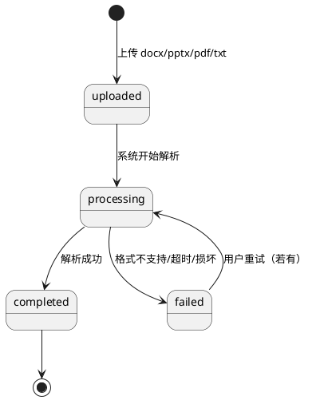

# 多格式文档支持

> 返回 [PRD 总览](./README.md) | 短期可重点推进

---

## 1. 模块背景

- **需求简介**：在现有 docx 基础上，扩展支持 pptx、pdf、txt 等格式的备课资料上传与解析，提取文本与结构供 AI 使用。
- **业务诉求**：满足教师使用课件、PDF 教材等多类资料备课的需求，提升资料覆盖度。

## 2. 业务流程简述

用户上传 pptx/pdf/txt 文件 → 系统校验格式与大小 → 异步解析提取文本 → 解析结果存入文档记录 → 状态更新为 completed/failed → 前端展示解析进度与结果；AI 对话可引用多格式文档内容。

---

## 3. 详细功能需求说明

### 3.1 上传与格式校验

- **位置**：会议创建第二步「上传备课资料」；与现有 docx 上传同一入口。
- **目标**：支持多格式选择与校验。

#### 3.1.1 界面元素与展示规则

- **支持格式**：.docx、.pptx、.pdf、.txt；扩展名大小写不敏感。
- **占位文案**：更新为「支持 docx、pptx、pdf、txt 格式」。
- **单文件大小**：docx/pptx/pdf 单文件不超过 20MB；txt 不超过 2MB。
- **校验失败**：不合规时轻提示具体原因，如「不支持该格式」或「文件超过 20MB」。

#### 3.1.2 交互逻辑与状态流转

- **选择文件**：点击或拖拽，允许多选；过滤掉不支持的格式，不支持的单独提示。
- **上传前校验**：客户端先校验格式和大小；通过后再发起上传。

#### 3.1.3 异常与系统边界

- **混合上传**：同一批次可混合 docx、pptx、pdf、txt；各自独立解析。
- **重名**：同名文件覆盖或自动重命名（如 文件名(1).pdf）；需明确规则。

---

### 3.2 解析与状态机

- **位置**：文档服务的异步解析流程；前端通过轮询或 WebSocket 获取状态。
- **目标**：对多格式文档进行文本提取，并更新解析状态。

#### 3.2.1 解析规则

| 格式 | 解析内容 | 备注 |
|------|----------|------|
| docx | 正文、标题、列表 | 现有逻辑 |
| pptx | 每页幻灯片文本、备注 | 按页顺序拼接 |
| pdf | 文本层提取 | 扫描版需 OCR（可选） |
| txt | 全文 | 编码兼容 UTF-8/GBK |

- **输出**：统一写入 `parsed_content` 字段；`summary` 可由 AI 后续提取或沿用现有逻辑。

#### 3.2.2 状态机（与现有一致）

| 状态 | 说明 |
|------|------|
| uploaded | 上传完成，待解析 |
| processing | 解析中 |
| completed | 解析成功 |
| failed | 解析失败 |

- **进度**：pptx/pdf 可按页/进度更新 `parse_progress`；前端展示「解析中 50%」。

#### 3.2.3 异常与系统边界

- **解析超时**：单文件解析超过 5 分钟标记为 failed；`error_message` 记录「解析超时」。
- **加密/损坏**：无法解析时标记 failed，`error_message` 如「文件可能已加密或损坏」。
- **OCR 开关**：pdf 扫描版可配置是否启用 OCR；首版可不实现，仅处理可提取文本的 PDF。

---

### 3.3 文档列表展示

- **位置**：上传区域下方的已上传列表；会议详情的备课资料列表。
- **目标**：按格式展示图标与状态，便于区分。

#### 3.3.1 界面元素与展示规则

- **格式图标**：docx/pptx/pdf/txt 各用不同图标或颜色标识。
- **单行信息**：文件名、格式、大小、状态（解析中/已完成/失败）。
- **失败态**：展示错误信息及「重新上传」或「重试」按钮（若支持）。

#### 3.3.2 交互逻辑与状态流转

- **删除**：与现有一致；删除后从列表移除，释放存储。
- **重试**：解析失败时可重试；重新进入 processing 状态。

---

### 3.4 AI 对话中的多格式引用

- **位置**：AI 对话的上下文构建逻辑。
- **目标**：AI 回答时可引用 pptx、pdf、txt 等已解析内容。

#### 3.4.1 规则

- **引用范围**：status=completed 的文档，不论格式，均参与上下文构建。
- **内容截断**：ppt/pdf 可能较长，按 token 或字符限制截断；优先保留前段与摘要。
- **格式标注**：在注入上下文中可标注来源格式，如「来自《xxx.pptx》第 3 页」。

#### 3.4.2  boundary

- **大文档**：单文档超长时，仅使用摘要或前 N 字；避免超出模型上下文限制。

---

## 4. 文档解析状态机（扩展）

---

## 5. 依赖与边界

- **技术依赖**：python-pptx（pptx）；PyPDF2 或 pdfplumber（pdf）；内置或第三方 OCR（扫描 pdf，可选）。
- **存储**：多格式文件统一存入 uploads/documents，路径与现有一致；需考虑大文件存储策略。
