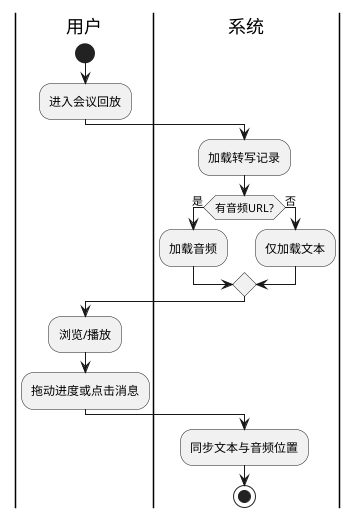

# 会议回放

> 返回 [PRD 总览](./README.md) | 短期可重点推进

---

## 1. 模块背景

- **需求简介**：支持对已结束会议的录音与转写文本按时间轴回放，用户可拖动进度、跳转到关键发言，便于回顾与补记。
- **业务诉求**：解决「会议时来不及细看、会后想回顾某段讨论」的需求，提升会议成果的复用价值。

## 2. 业务流程简述

会议结束且通义听悟任务完成后 → 系统保存转写文本与音频 URL（如有）→ 用户进入会议总结或回放入口 → 按时间轴展示转写记录与可选音频 → 用户拖动进度条或点击某条发言 → 定位到对应位置并播放音频（若有）。

---

## 3. 详细功能需求说明

### 3.1 回放入口

- **位置**：会议总结页「会议回放」Tab 或区块；会议列表「回放」操作。
- **目标**：提供回放功能入口。

#### 3.1.1 界面元素与展示规则

- **入口**：「会议回放」或「回放讨论」按钮/链接。
- **前置条件**：仅已结束且有转写记录的会议显示入口；无转写时展示「暂无回放内容」。
- **音频可用性**：若通义听悟返回了 MP3 URL，则支持音视频回放；否则仅支持文本时间轴浏览。

#### 3.1.2 交互逻辑与状态流转

- **进入回放**：点击进入回放页或展开回放区域。
- **加载**：请求转写记录（按时间排序的消息列表）；若有音频，预加载音频 URL。

#### 3.1.3 异常与系统边界

- **转写为空**：展示「本次会议无转写记录」。
- **音频加载失败**：降级为仅文本回放；可轻提示「音频暂时无法播放」。

---

### 3.2 时间轴与文本展示

- **位置**：回放主区域。
- **目标**：按时间顺序展示会议讨论记录，支持滚动与定位。

#### 3.2.1 界面元素与展示规则

- **时间轴**：左侧或顶部展示时间轴；刻度可按会议时长划分（如每 5 分钟一档）。
- **消息列表**：每条消息含说话人、内容、时间戳（绝对时间或相对会议开始的偏移）；人类与 AI 消息样式区分。
- **阶段标签**：每条消息可带阶段标签（主持人发言/教师发言/集体研讨/形成结论）；用不同颜色或图标区分。
- **当前播放位置**：若有音频，当前播放对应的消息高亮或标记。
- **溢出与截断**：单条内容过长时，默认展示前 3 行，展开可看全文。

#### 3.2.2 交互逻辑与状态流转

- **点击消息**：若存在音频，跳转到对应时间点并播放；若无音频，仅滚动到该消息并高亮。
- **拖动进度条**：若有音频，拖动到某时刻并播放；文本区域同步滚动到该时刻附近的消息。
- **快捷键**：支持空格键暂停/播放；左右箭头快退/快进 10 秒（若有音频）。

#### 3.2.3 异常与系统边界

- **时间戳缺失**：部分消息无时间戳时，按顺序插入；进度条拖动时按插值估算位置。
- **仅文本模式**：无音频时，点击消息仅做滚动定位；进度条可隐藏或禁用。

---

### 3.3 音频播放（可选）

- **位置**：回放页的音频播放器；可与时间轴联动。
- **目标**：播放会议录音，与转写文本同步。

#### 3.3.1 界面元素与展示规则

- **播放器**：底部或顶部固定；含播放/暂停、进度条、当前时间/总时长、音量。
- **生命周期**：加载 → 可播放 → 播放中 → 暂停/结束。
- **无音频时**：播放器隐藏或展示「暂无录音」提示。

#### 3.3.2 交互逻辑与状态流转

- **播放**：点击播放；进度条随播放更新；当前播放位置对应的消息高亮并自动滚动到可视区域。
- **拖动进度**：拖动进度条，音频跳转；文本区域同步。
- **倍速**：支持 0.5x、1x、1.5x、2x 倍速切换。

#### 3.3.3 异常与系统边界

- **音频 URL 过期**：若通义听悟 URL 有时效，过期后提示「录音已过期」；可考虑转存到自有存储。
- **网络弱**：加载超时时提示「加载失败，请检查网络」；支持重试。

---

### 3.4 关键发言定位（增强）

- **位置**：回放页的辅助功能。
- **目标**：快速跳转到 AI 总结的要点对应位置。

#### 3.4.1 规则

- **要点关联**：若会议总结的「要点」能与转写消息关联（如通过关键词或时间区间），在要点旁提供「定位」按钮。
- **点击定位**：跳转到对应消息并高亮；若有音频则从该点开始播放。

#### 3.4.2 边界

- **无法关联时**：不显示定位按钮；或提供「搜索转写内容」作为替代。

---

## 4. 流程与状态图表

---

## 5. 依赖与边界

- **前置依赖**：会议转写记录（transcript 消息列表）；通义听悟任务完成后的 MP3 URL（可选）。
- **存储**：音频 URL 需持久化；若 URL 有时效，需评估自建存储方案。
