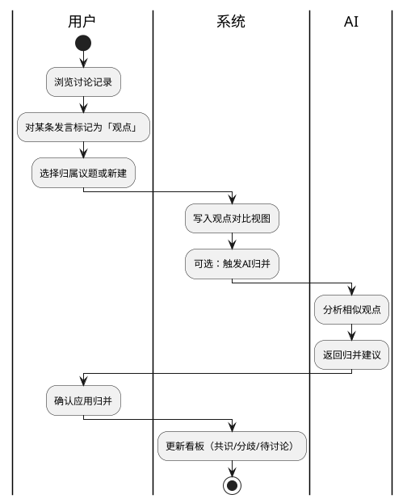

# 观点对比与共识看板

> 返回 [PRD 总览](./README.md) | 中期可规划

---

## 1. 模块背景

- **需求简介**：在实时会议中提供「观点对比」与「共识/分歧看板」，帮助主持人快速梳理讨论成果，推进形成结论。
- **业务诉求**：解决多教师发言观点分散、分歧点难以聚焦的问题，通过结构化展示促进共识形成与分歧收敛。

## 2. 业务流程简述

会议进行中 → AI 或用户标记观点/分歧 → 系统归并相似观点、识别分歧点 → 看板实时更新「共识区」「分歧区」「待讨论」→ 主持人引导讨论 → 分歧转为共识后拖入共识区。

---

## 3. 详细功能需求说明

### 3.1 观点对比视图

- **位置**：实时会议页右侧栏或可展开面板；与「网络资料」并列或切换展示。
- **目标**：将不同教师对同一问题的观点并排呈现，便于对比与融合。

#### 3.1.1 界面元素与展示规则

- **静态文案**：面板标题「观点对比」；空态时展示「暂无标记观点」。
- **动态内容**：
  - 每个「议题」下展示 1～N 条「观点」，每条关联说话人、发言原文摘要、所属阶段。
  - 同议题下多观点并排或上下排列，视觉上清晰区分不同教师。
- **溢出与截断**：观点原文超出 100 字时，单行截断尾部加「...」，点击展开全文。
- **空态**：无议题时展示引导文案「在讨论中可对发言标记为观点，便于对比」。

#### 3.1.2 交互逻辑与状态流转

- **初始化**：进入会议时加载已标记观点；新标记实时推送更新。
- **触发**：用户对某条发言点击「加入观点」或右键菜单「标记为观点」；可选择归属「已有议题」或「新建议题」。
- **执行中**：标记后按钮短暂加载态（<300ms），成功后列表即时刷新。
- **执行异常**：标记失败时轻提示「标记失败，请重试」。
- **执行成功**：观点出现在对应议题下，发言条显示「已标记」徽章。

#### 3.1.3 异常与系统边界

- **并发**：多人同时标记同一条发言时，以先到先得，后到者提示「该观点已存在」。
- **弱网**：标记请求超时 5 秒后提示「网络不稳定，请稍后重试」。

---

### 3.2 共识与分歧看板

- **位置**：实时会议页中部或可切换 Tab，与「讨论记录」并列；或折叠于侧边栏。
- **目标**：实时维护「共识区」「分歧区」「待讨论」清单，辅助主持人推进议程。

#### 3.2.1 界面元素与展示规则

- **三区布局**：
  - **共识区**：已达成一致的结论条目；每条为精简描述，最多 80 字，超出截断。
  - **分歧区**：存在不同观点的议题；展示议题标题、各方观点摘要、讨论阶段。
  - **待讨论**：尚未深入讨论的待决项；来源为 AI 提取或用户手动添加。
- **视觉区分**：共识区绿色边框或图标；分歧区橙色；待讨论灰色。
- **空态**：各区无内容时展示占位符「暂无」「待补充」及引导说明。

#### 3.2.2 交互逻辑与状态流转

- **添加待讨论**：用户可手动添加「待讨论」条目；或 AI 根据讨论内容自动提取候选，用户确认后加入。
- **分歧 → 共识**：用户将分歧区某条拖拽至共识区（或点击「转为共识」），系统记录转换时间；原分歧条目标记为「已解决」并归档。
- **共识 → 分歧**：若后续讨论出现新分歧，可将已共识条目移回分歧区（少见，需确认操作）。
- **删除**：支持删除误添加条目，删除前弹窗确认「确定删除？」。
- **执行中**：拖拽或点击操作时显示短暂加载态；成功后看板刷新。
- **执行异常**：操作失败时轻提示错误原因。

#### 3.2.3 异常与系统边界

- **数据一致性**：看板数据与会议绑定，会议结束后可查看历史快照，不可再编辑。
- **多端同步**：多人同时编辑时，以后端合并策略为准，冲突时采用「最后写入优先」并轻提示「内容已更新」。

---

### 3.3 AI 辅助归并与提取

- **位置**：后台逻辑，前端通过「智能归并」「AI 提取待讨论」按钮触发。
- **目标**：降低人工标记负担，自动识别相似观点、提取分歧与待讨论项。

#### 3.3.1 界面元素与展示规则

- **按钮**：「智能归并观点」「提取待讨论项」；位于看板顶部或工具栏。
- **执行中**：点击后展示「AI 分析中...」；可展示进度条或步骤（分析中→归并中→完成）。
- **结果展示**：分析完成后弹窗或内联展示「发现 N 条可归并观点」「发现 M 条待讨论项」，用户勾选后批量应用。
- **空态**：无可用归并或提取结果时，轻提示「暂无新发现」。

#### 3.3.2 交互逻辑与状态流转

- **触发**：用户点击「智能归并」或「提取待讨论」。
- **执行中**：请求发送后按钮禁用，展示加载态；超时 30 秒则中断并提示「分析超时」。
- **执行成功**：展示候选列表，用户可全选/反选后点击「应用」；应用后看板更新。
- **执行异常**：AI 服务失败时提示「智能分析暂不可用，请稍后重试」。
- **取消**：用户可关闭结果弹窗放弃应用，不做任何变更。

#### 3.3.3 异常与系统边界

- **依赖**：需配置 DASHSCOPE_API_KEY；未配置时按钮置灰，悬停提示「请先配置 AI 服务」。
- **降级**：AI 不可用时，看板仍支持纯手动维护。

---

## 4. 流程与状态图表

### 4.1 观点与看板数据流

---

## 5. 附录（PlantUML 源码）

见上文 4.1。
