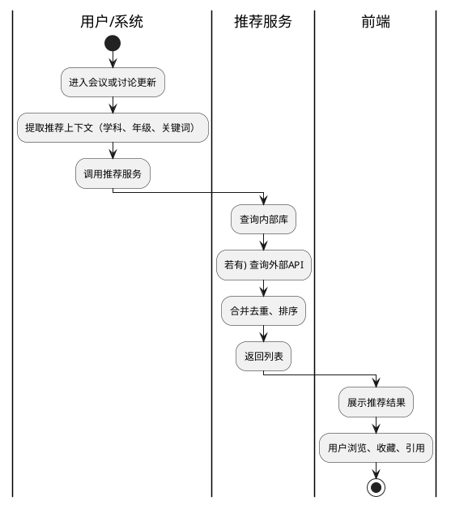

# 教学资源推荐

> 返回 [PRD 总览](./README.md) | 中期可规划

---

## 1. 模块背景

- **需求简介**：在备课讨论中，根据学科、年级、备课主题自动推荐教案、课件、试题、微课等教学资源，拓宽备课素材来源。
- **业务诉求**：解决教师寻找优质资源耗时、来源分散的问题，通过智能推荐提升备课效率与教学质量。

## 2. 业务流程简述

会议创建时录入学科/年级/备课类型 → 上传文档解析出主题与知识点 → 会议讨论中识别关键词 → 系统根据上下文调用推荐服务（内部资源库 / 国家智慧教育平台 / 公开 API）→ 返回推荐列表 → 用户浏览、收藏或引用。

---

## 3. 详细功能需求说明

### 3.1 推荐触发与入口

- **位置**：实时会议页右侧栏「教学资源」Tab，或与「网络资料」并列；会议创建页可选「查看推荐资源」。
- **目标**：在合适时机展示与当前备课相关的资源推荐。

#### 3.1.1 界面元素与展示规则

- **入口**：侧边栏「教学资源」图标或 Tab；首次进入时默认折叠，用户可展开。
- **静态文案**：展开后标题「教学资源推荐」；副标题「基于当前学科、年级与讨论内容智能推荐」。
- **触发时机展示**：展示当前用于推荐的关键词或主题（如「分数初步认识、三年级数学」）；可编辑或刷新。
- **空态**：无推荐结果时展示「暂无推荐资源」及「点击刷新」按钮。

#### 3.1.2 交互逻辑与状态流转

- **自动触发**：进入会议后，根据会议学科、年级、文档摘要自动发起一次推荐请求；讨论内容更新时，可设置防抖（如 30 秒）后自动刷新推荐。
- **手动刷新**：用户点击「刷新推荐」按钮，重新请求；刷新时展示加载态，禁用重复点击（防抖 3 秒）。
- **关键词编辑**：用户可修改推荐关键词，修改后触发展示更新。
- **执行成功**：展示推荐列表；执行异常：展示错误提示及「重试」按钮。

#### 3.1.3 异常与系统边界

- **无上下文**：会议未设置学科、年级且无文档时，提示「请先完善会议信息或上传备课资料」。
- **推荐服务不可用**：接口超时或失败时，展示「推荐服务暂不可用，请稍后重试」；不阻断会议其他功能。

---

### 3.2 推荐结果列表

- **位置**：教学资源面板主内容区。
- **目标**：以列表形式呈现推荐资源，支持筛选、排序与快捷操作。

#### 3.2.1 界面元素与展示规则

- **单条资源**：
  - 标题：资源名称，最多单行 40 字，超出截断加「...」；
  - 类型标签：教案、课件、试题、微课、其他；
  - 来源标签：如「智慧教育平台」「校本库」「网络」；
  - 摘要：1～2 行简介，最多 80 字；
  - 适用：学科、年级（若有）；
  - 操作：收藏、打开链接、引用到讨论。
- **列表加载**：默认每页 10 条，支持上拉加载更多或分页。
- **空态**：无结果时展示「未找到匹配资源」及建议「尝试调整关键词」。
- **溢出**：标题、摘要统一截断规则，悬停展示完整内容气泡。

#### 3.2.2 交互逻辑与状态流转

- **加载**：进入面板或刷新时请求第一页；滚动到底部加载下一页。
- **收藏**：点击收藏图标，未收藏→已收藏；已收藏→取消收藏。执行中按钮短暂加载态；成功后图标状态切换。
- **打开链接**：点击标题或「查看」按钮，新标签页打开资源链接；若为内部资源，则当前页跳转预览。
- **引用到讨论**：点击「引用」，将资源标题与链接以固定格式插入当前讨论输入框或作为一条系统消息插入讨论区；执行成功后轻提示「已引用」。
- **执行异常**：收藏失败提示「收藏失败，请重试」；链接无效时提示「链接失效」。

#### 3.2.3 异常与系统边界

- **链接失效**：资源链接 404 或超时时，标记为「可能失效」，仍可展示标题供用户参考。
- **权限**：部分资源可能需登录外部平台，打开后由外部页面处理，本系统仅负责跳转。

---

### 3.3 推荐策略与数据来源

- **位置**：后台配置与实现；前端可通过设置页配置「推荐来源」优先级（若支持多源）。
- **目标**：明确推荐逻辑与数据源，保证推荐质量与可扩展性。

#### 3.3.1 策略说明

- **输入**：会议学科、年级、备课类型、文档解析摘要、讨论关键词（AI 提取或用户指定）。
- **输出**：资源列表，按相关性排序；每条含标题、类型、来源、链接、摘要、适用学段。
- **数据来源**（可选实现顺序）：
  1. 内部备课知识库（历史会议沉淀的优质资源）；
  2. 国家智慧教育平台公开 API（若有）；
  3. 校本资源库（若学校对接）；
  4. 通用网络搜索（SerpApi 等）作为兜底。
- **去重**：同一资源多源命中时合并为一条，标注多来源。

#### 3.3.2 依赖与配置

- **配置项**：推荐服务开关、API 地址、超时时间、每页条数。
- **降级**：主源不可用时，可回退至网络搜索；全部不可用时，列表为空并提示原因。

---

### 3.4 收藏与个人资源库（可选）

- **位置**：设置页或独立「我的收藏」入口。
- **目标**：用户收藏的资源可统一管理，便于跨会议复用。

#### 3.4.1 界面元素与展示规则

- **列表**：与推荐列表结构类似，展示已收藏资源；支持按收藏时间、类型筛选。
- **操作**：取消收藏、打开、引用到指定会议。
- **空态**：无收藏时展示「暂无收藏，在备课中可收藏心仪资源」。

#### 3.4.2 交互逻辑

- 取消收藏：点击取消后从列表移除，轻提示「已取消收藏」。
- 引用到会议：选择目标会议后，将资源信息插入该会议讨论或资料区。

#### 3.4.3 异常与系统边界

- 收藏数据与用户账号绑定；跨设备需登录同步。
- 资源链接失效后，收藏仍保留，但打开时提示「链接可能已失效」。

---

## 4. 流程与状态图表

### 4.1 推荐流程

---

## 5. 附录（PlantUML 源码）

见上文 4.1。
